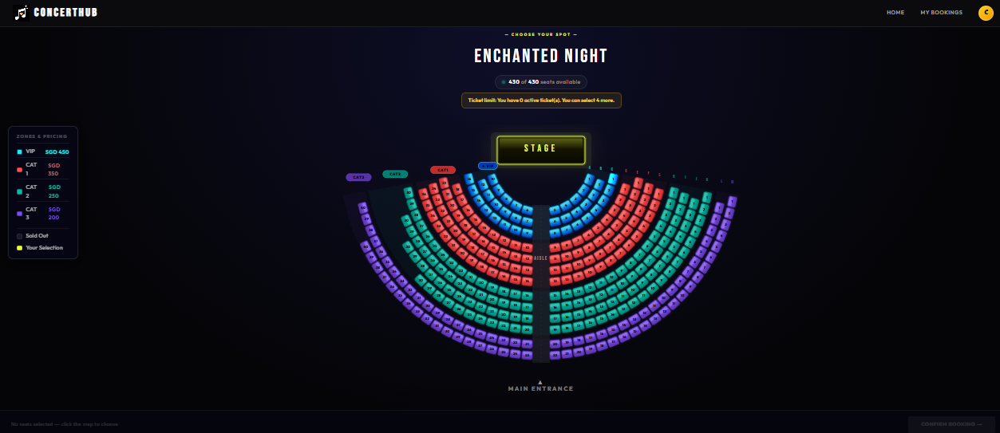
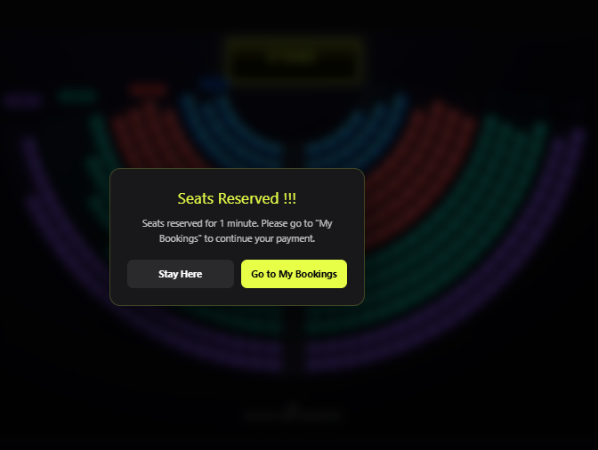
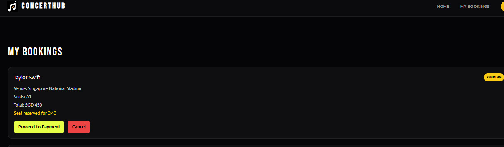
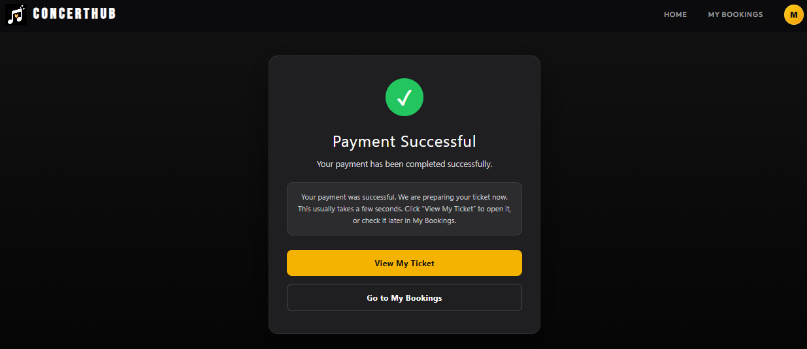
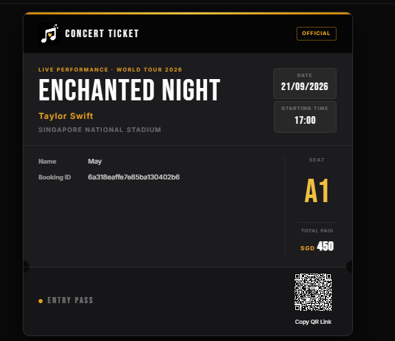
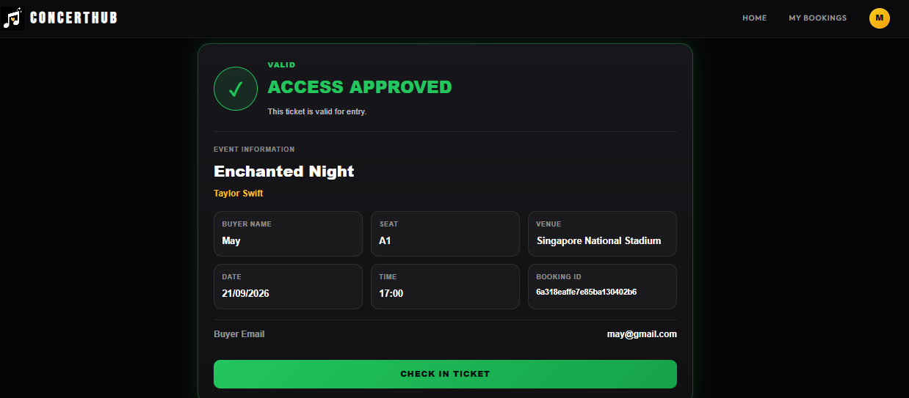
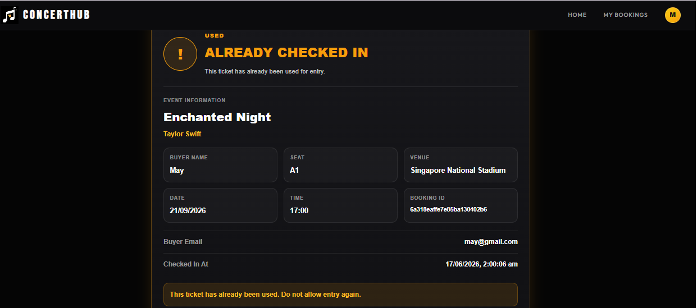
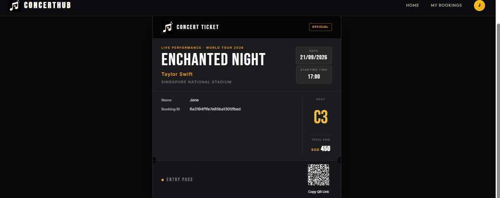

# ConcertHub

ConcertHub is a full-stack concert ticket booking platform that allows users to browse events, select seats in real time, complete secure payments, receive QR-code tickets, and manage bookings through a modern web interface.

The platform includes role-based access control for administrators, real-time seat reservation updates using Socket.IO, Stripe payment integration, and QR ticket verification.

## Features

### User Features

- User registration and login
- JWT authentication
- Browse available concerts
- View concert details
- Real-time seat selection
- Seat reservation timer
- Secure Stripe payments
- Booking history
- QR-code ticket generation
- Booking cancellation

### Admin Features

- Create concerts
- Update concerts
- Delete concerts
- Upload concert images
- Manage ticket availability
- Verify tickets using QR codes
- Check-in attendees

### Real-Time Features

- Live seat reservation updates
- Seat locking during checkout
- Automatic seat release on timeout
- Multi-user booking protection

## Tech Stack

### Frontend

- React
- Vite
- React Router
- Axios
- Socket.IO Client
- QRCode React

### Backend

- Node.js
- Express.js
- MongoDB
- Mongoose
- JWT Authentication
- Bcrypt
- Socket.IO
- Stripe

### Cloud Services

- Cloudinary
- Stripe Checkout
- Render
- Vercel


## Screenshots

### Home Page


### Seat Booking


### Booking


### Payment Successful


### View Ticket


### Ticket Approve By Admin 


### Ticket Verified 



## Demo





## Getting Started

### Clone Repository

```bash
git clone https://github.com/MayThetNaingBo/concert-booking-system.git
cd concert-booking-system
```

## Backend Setup

```bash
cd server
npm install
```

## Frontend Setup

```bash
cd client
npm install
npm run dev
```

Frontend:

```text
http://localhost:5173
```

### Environment Variables

Copy `.env.example` to `.env` and fill in your own values.


## How It Works

1. User signs in.
2. User selects a concert.
3. User chooses available seats.
4. Seats are temporarily locked.
5. User completes Stripe payment.
6. Booking is confirmed.
7. QR ticket is generated.
8. User can access booking history.
9. Admin verifies ticket during check-in.

## Note 
- Use Stripe Developer Card Number for Fake Payment (e.g. 4242 4242 4242 4242)
- Fill in any future dates and CVC


## Deployment

### Frontend

Vercel

### Backend

Render

### Database

MongoDB Atlas

### Media Storage

Cloudinary

## What I Learned

* Full-stack application architecture
* JWT authentication and authorization
* MongoDB schema design
* Real-time communication using Socket.IO
* Stripe payment integration
* QR-code ticket systems
* Cloudinary media management
* API design and validation
* Deployment with Vercel and Render
* Handling concurrent seat reservations

## Future Improvements

* Email notifications
* Seat map visualization improvements
* Analytics dashboard
* Event organizer accounts
* Refund management
* Multi-payment provider support
* Mobile application
* CI/CD pipeline

## Author

**May Thet Naing Bo**<br>
Diploma in Information Technology<br>
Temasek Polytechnic<br>
🌐 https://maythetnaingbo.com
